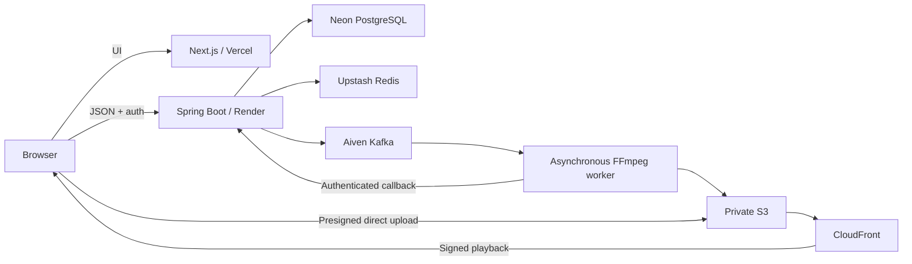

# Clip

A Next.js interface for asynchronous screen recording and video collaboration, with typography and layouts inspired by [Mobbin](https://mobbin.com/).

## Current scope

This is the **UI-first implementation**. The workspace was empty when this pass began. It includes the landing page, library, browser recorder, registration and login forms, creator and share pages, comments interface, and viewing insights interface.

**Available without a backend:**

- Real browser screen capture, optional microphone and available screen audio.
- Pause, resume, stop, local playback preview, and download of the captured recording.
- Recording stops at ten minutes or the size limit; uploads reject recordings over 200 MB.
- Responsive navigation, library search/filter/sort controls, accessible forms, and loading, empty, error, and processing states.

**Requires the separate cloud implementation:** accounts, authentication, persistent libraries, direct object-storage uploads, processing, share links, comments, and analytics. The UI calls the API contracts below when configured, but this repository does not yet contain the Spring Boot service, infrastructure, or FFmpeg processor. It has no seeded videos, fabricated viewing numbers, simulated authentication, or simulated upload success. This is not the deployed end-to-end MVP in the original product brief.

## Run locally

Use Node.js 22.13+ or a current supported LTS release.

```bash
npm ci
npm run dev
```

Open http://127.0.0.1:3000. Screen capture needs a compatible desktop browser and HTTPS or localhost. Chrome and Edge are recommended for testing microphone and tab-audio capture. The user must choose a screen and grant permissions themselves. Mobile browsers without screen capture show an explicit unsupported-browser message.

On Windows, the build preparation step removes read-only flags from generated `.next` directories. This avoids rebuild failures in OneDrive-synced workspaces; it does not alter source files or follow symbolic links.

```bash
npm run lint
npm run typecheck
npm run build
```

## Design

- White backgrounds, large compact headings, black pill buttons, restrained gray surfaces, and generous spacing.
- Mobbin uses Saans. Clip uses the open-source **Inter Variable** font, self-hosted through `@fontsource-variable/inter`; proprietary font files have not been copied.
- A small green accent gives Clip its own identity while preserving the reference’s visual restraint.
- Mobile and desktop layouts, visible focus states, native modal dialogs, reduced-motion support, and descriptive control labels.

## Routes

| Route                        | Screen                                                    |
| ---------------------------- | --------------------------------------------------------- |
| `/`                          | Landing page with a functional embedded recorder          |
| `/dashboard`                 | Video library                                             |
| `/record`                    | Recorder, preview, download, and configured upload        |
| `/register`, `/login`        | Account forms                                             |
| `/videos/:videoId`           | Creator playback, sharing, rename, deletion, and comments |
| `/videos/:videoId/analytics` | Owner viewing insights                                    |
| `/s/:shareToken`             | Unlisted playback and guest comments                      |

## Connecting the backend

Copy `.env.example` to `.env.local`, set `NEXT_PUBLIC_API_URL` to the Spring Boot API origin, and restart the frontend. No secret belongs in this public environment variable. Configure the API’s CORS allowlist for the exact frontend origin, with credential support.

The client keeps JWT access tokens in memory. Refresh cookies must be HttpOnly and securely configured by Spring Security. Refresh requests are deduplicated; protected requests retry once after refreshing. The UI requires real API responses and surfaces failures. Browser storage is used only for the anonymous analytics identifier, not credentials or video persistence.

### API response contracts

| Endpoint                                                      | Expected response                                                               |
| ------------------------------------------------------------- | ------------------------------------------------------------------------------- |
| `POST /api/auth/register`, `POST /api/auth/login`             | `{ user: { id, displayName, email }, accessToken }`                             |
| `POST /api/auth/refresh`                                      | `{ accessToken, user? }`; if `user` is omitted, the client calls `/api/auth/me` |
| `GET /api/auth/me`                                            | `{ id, displayName, email }`                                                    |
| `POST /api/auth/logout`                                       | HTTP 204                                                                        |
| `GET /api/videos`                                             | Array of `ClipVideo` records (see `src/lib/types.ts`)                           |
| `GET /api/videos/:id`                                         | One `ClipVideo`                                                                 |
| `POST /api/videos`                                            | `{ videoId, uploadUrl }`, after validating title, MIME type, and size           |
| `POST /api/videos/:id/complete`, `POST /api/videos/:id/retry` | HTTP 204 or JSON response                                                       |
| `PATCH /api/videos/:id`                                       | Accepts `{ title }`                                                             |
| `DELETE /api/videos/:id`                                      | HTTP 204                                                                        |
| `GET /api/videos/:id/playback`                                | `{ playbackUrl, expiresAt }`                                                    |
| `POST /api/videos/:id/share`                                  | `{ shareUrl }`                                                                  |
| `DELETE /api/videos/:id/share`                                | HTTP 204                                                                        |
| `GET /api/shares/:token`                                      | Sanitized `ClipVideo` plus `playbackUrl` and `creatorDisplayName`               |
| `GET /api/videos/:id/comments`                                | Array of `{ id, displayName, message, timestampSeconds, createdAt }`            |
| `POST /api/videos/:id/comments`                               | The created comment; accepts `{ message, timestampSeconds, guestDisplayName? }` |
| `POST /api/videos/:id/analytics/progress`                     | `{ sessionId }`                                                                 |
| `GET /api/videos/:id/analytics`                               | `Analytics` from `src/lib/types.ts`; percentage values on a 0–100 scale         |

Share-authorized comments and analytics send `shareToken` as a query parameter. The backend must validate it before accepting any read or write. Error responses should use `{ message }` and appropriate HTTP status codes. User-facing messages must not expose internals.

The presigned upload URL receives the actual video bytes directly from the browser. Video bytes never pass through Spring Boot. The storage CORS configuration must permit `PUT` and the signed `Content-Type`. Upload completion must validate the stored object before triggering processing. Authorization, limits, validation, rate limiting, hashing, job idempotency, and secure delivery must be enforced by the backend, regardless of UI checks.

## Planned production architecture



This architecture is the integration target, not infrastructure provisioned by this UI pass. The Next.js app can be deployed to Vercel after the backend is available; set `NEXT_PUBLIC_API_URL` at build time.

## Validation boundaries

Lint, TypeScript, production build, and browser UI checks cover this frontend. Real screen recording requires a manual browser permission flow. Cloud integration and production end-to-end behavior cannot be verified until those services exist. Source-level recorder support is not a substitute for testing actual media capture on each target browser.
