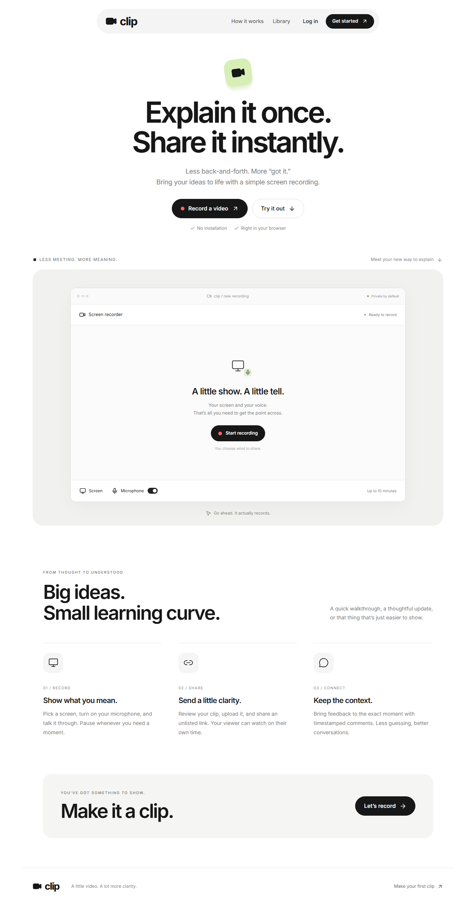
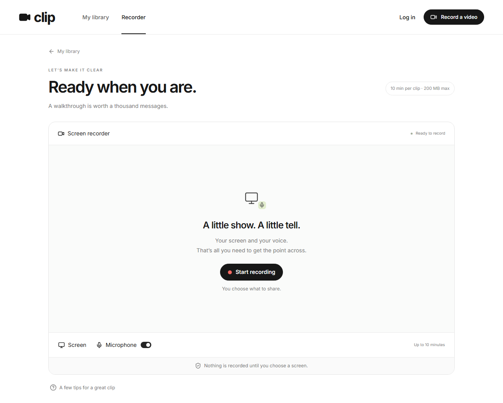
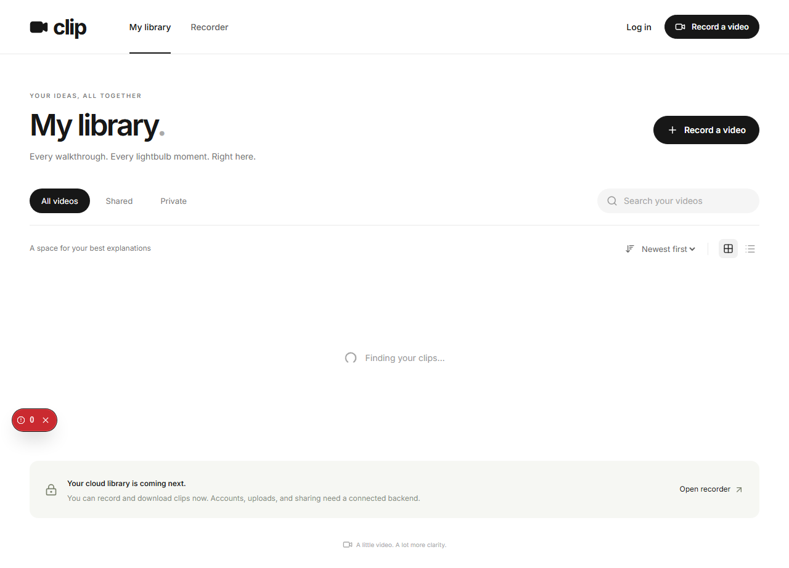
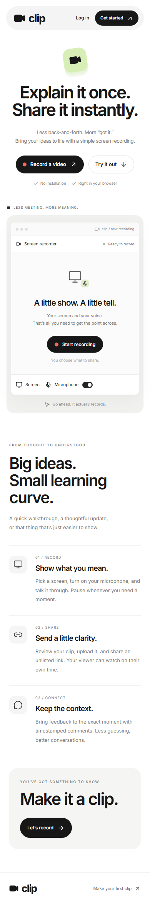
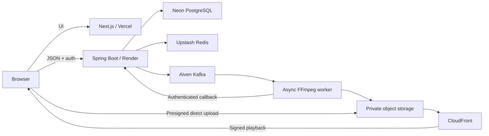

# Clip

### Explain it once. Share it instantly.

Clip is a focused screen recording workspace for the moments when a paragraph is too slow and a meeting is too much. Record a walkthrough, keep the useful context, and send one clear link.

<p align="center">
  
</p>

<p align="center">
  <a href="https://github.com/Krrish-Verma/clip"><strong>View the repository</strong></a>
  ·
  <a href="#getting-started">Run it locally</a>
  ·
  <a href="#product-tour">See the product tour</a>
</p>

<p align="center">
  
  
  
  
</p>

## The idea

Most product communication gets harder than it needs to be. Clip gives a team a small, calm place to show the screen, say what matters, and let the other person watch when they have the context to act.

The interface is deliberately quiet: compact navigation, oversized editorial type, soft gray surfaces, black pill buttons, and one fresh green accent. It takes cues from Mobbin’s visual rhythm while keeping Clip’s own voice.

## Product tour

### Start with the point

The landing page puts the action in the middle of the screen. A visitor can understand the product and start recording without hunting through a dashboard first.

### Record in the browser

The recorder supports screen capture, optional microphone and available system audio, pause and resume, a ten-minute limit, local playback, and download. The browser asks the person recording to choose exactly what to share.

<p align="center">
  
</p>

### Keep the library close

The library has the shape of a real product surface: tabs, search, sorting, grid/list controls, empty and loading states, and a clear path back to recording. It is ready to connect to persistent video data when the cloud service is added.

<p align="center">
  
</p>

### Designed to travel

The layout compresses into a useful mobile experience without losing the main action or the visual hierarchy.

<p align="center">
  
</p>

## What is working now

- Browser screen recording with optional microphone and available screen audio.
- Pause, resume, stop, local preview, and download of the captured recording.
- A ten-minute recording limit and a 200 MB upload guardrail.
- Responsive landing page, recorder, library, auth forms, playback, comments, sharing, and analytics surfaces.
- Loading, empty, processing, error, and unsupported-browser states.
- Accessible labels, visible focus states, native dialogs, reduced-motion support, and keyboard-friendly controls.
- A typed API client that is ready to connect to the planned cloud service.

## Current scope

This repository is the UI-first implementation of Clip. It does not pretend to have a cloud backend behind the screens. Accounts, persistent libraries, object-storage uploads, video processing, share links, comments, and analytics still need the separate service described in [Connecting the backend](#connecting-the-backend).

That boundary is intentional: the browser recorder is real, while cloud actions surface honest states until the API is configured. There are no seeded videos, fabricated view counts, simulated authentication, or fake upload success.

## Getting started

### Requirements

- Node.js 22.13+ or a current supported LTS release.
- A desktop browser with screen-capture support. Chrome and Edge are recommended.

### Install and run

```bash
git clone https://github.com/Krrish-Verma/clip.git
cd clip
npm ci
npm run dev
```

Open [http://127.0.0.1:3000](http://127.0.0.1:3000).

Screen capture works on `localhost` and HTTPS. The browser permission flow is user-controlled: choose a screen, tab, or window when prompted and grant microphone or system-audio access when needed. Mobile browsers that cannot capture a screen show an explicit unsupported-browser message.

### Validate a production build

```bash
npm run lint
npm run typecheck
npm run build
npm run start
```

On Windows, the build preparation script removes read-only flags from generated `.next` directories. This keeps rebuilds reliable in OneDrive-synced workspaces without changing source files or following symbolic links.

## Routes

| Route | Experience |
| --- | --- |
| `/` | Landing page with an embedded recorder preview |
| `/record` | Full recorder, preview, download, and configured upload flow |
| `/dashboard` | Video library with search, filters, sorting, and view controls |
| `/register` · `/login` | Account entry forms |
| `/videos/:videoId` | Creator playback, sharing, rename, deletion, and comments |
| `/videos/:videoId/analytics` | Owner viewing insights |
| `/s/:shareToken` | Unlisted playback and guest comments |

## Connecting the backend

Copy `.env.example` to `.env.local`, set `NEXT_PUBLIC_API_URL` to the Spring Boot API origin, and restart the frontend:

```bash
cp .env.example .env.local
```

Configure the API CORS allowlist for the exact frontend origin with credential support. The client keeps access tokens in memory; refresh cookies should be HttpOnly and securely configured by Spring Security. Refresh requests are deduplicated, protected requests retry once after refresh, and API failures are shown to the person using the product.

### API contracts

| Endpoint | Expected response |
| --- | --- |
| `POST /api/auth/register` · `POST /api/auth/login` | `{ user, accessToken }` |
| `POST /api/auth/refresh` | `{ accessToken, user? }` |
| `GET /api/auth/me` | `{ id, displayName, email }` |
| `POST /api/auth/logout` | HTTP `204` |
| `GET /api/videos` | Array of `ClipVideo` records |
| `GET /api/videos/:id` | One `ClipVideo` |
| `POST /api/videos` | `{ videoId, uploadUrl }` |
| `POST /api/videos/:id/complete` · `/retry` | HTTP `204` or JSON |
| `PATCH /api/videos/:id` | Accepts `{ title }` |
| `DELETE /api/videos/:id` | HTTP `204` |
| `GET /api/videos/:id/playback` | `{ playbackUrl, expiresAt }` |
| `POST /api/videos/:id/share` | `{ shareUrl }` |
| `DELETE /api/videos/:id/share` | HTTP `204` |
| `GET /api/shares/:token` | Sanitized video plus playback URL |
| `GET /api/videos/:id/comments` | Array of timestamped comments |
| `POST /api/videos/:id/comments` | Created comment |
| `POST /api/videos/:id/analytics/progress` | `{ sessionId }` |
| `GET /api/videos/:id/analytics` | `Analytics` from `src/lib/types.ts` |

Share-authorized comments and analytics pass `shareToken` as a query parameter. The backend must validate it before accepting reads or writes. The presigned upload URL receives video bytes directly from the browser, so the API never proxies the media payload.

## Planned production shape



The diagram is the integration target for the frontend. Infrastructure is not provisioned in this repository. The Next.js app can be deployed after the backend exists by setting `NEXT_PUBLIC_API_URL` at build time.

## Project map

```text
src/app/                 App Router pages and route-level states
src/components/          Recorder, library, playback, auth, dialogs, and UI primitives
src/lib/api.ts           Typed API client and refresh handling
src/lib/types.ts         Shared frontend domain types
src/app/globals.css      Clip design system and responsive layout
scripts/prepare-build.mjs Windows/OneDrive build preparation
docs/screenshots/        Product screenshots used in this README
```

## Design details

- **Typography:** self-hosted Inter Variable, chosen for a close open-source equivalent to Mobbin’s Saans.
- **Composition:** generous whitespace, restrained gray surfaces, compact labels, oversized headings, and strong black actions.
- **Personality:** a single green accent and small motion cues keep the interface warm without turning it into a noisy dashboard.
- **Accessibility:** descriptive control labels, visible focus states, native dialogs, reduced-motion support, and responsive layouts are part of the base UI.

## Validation boundary

Lint, TypeScript, production build, and browser UI checks cover the frontend. Actual media capture still needs a manual permission flow on each target browser. Cloud integration, storage, processing, and production end-to-end behavior remain to be verified when the backend services are connected.

## Built with

Next.js · React · TypeScript · Inter Variable · Tailwind CSS · Lucide React · MediaRecorder API
